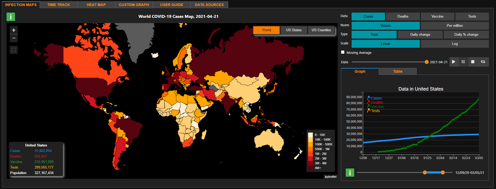
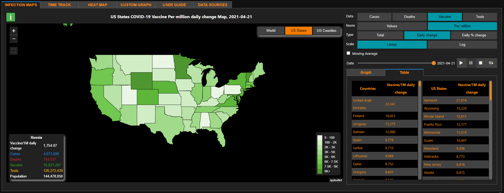
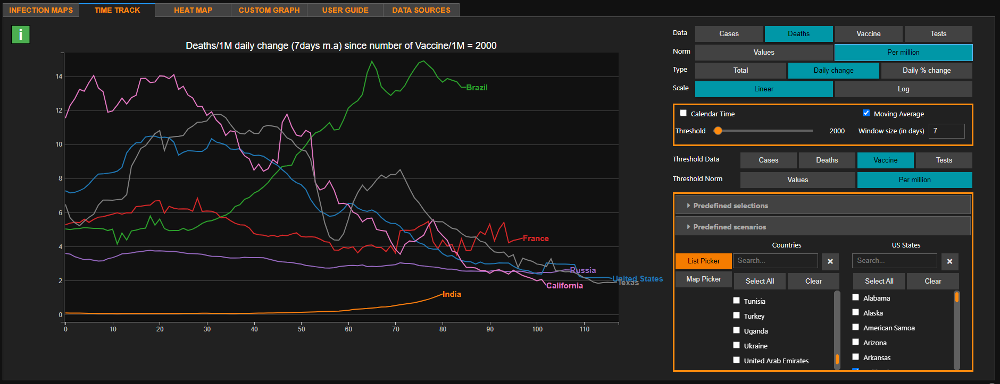
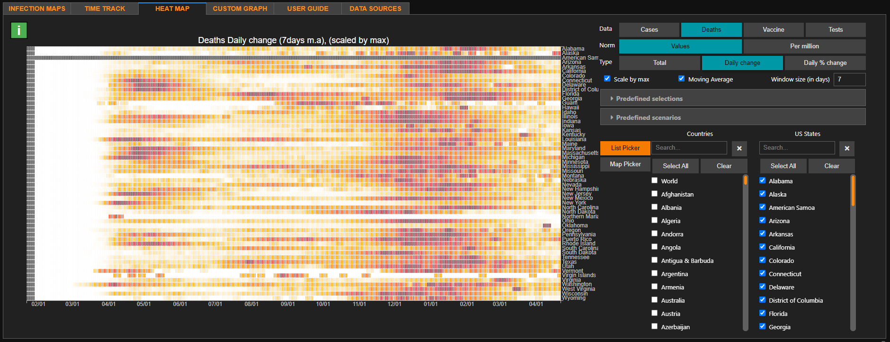
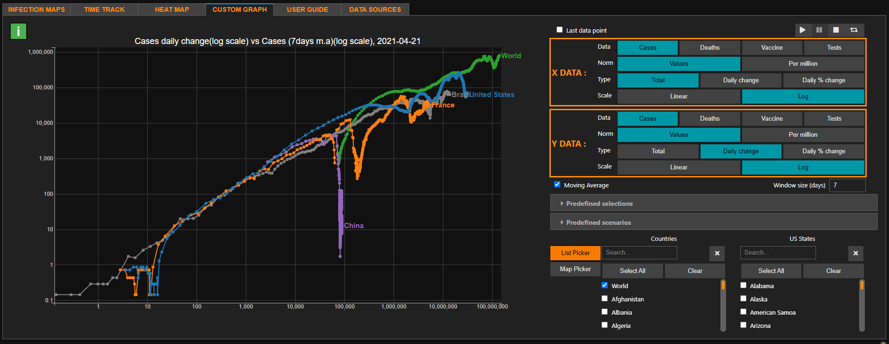
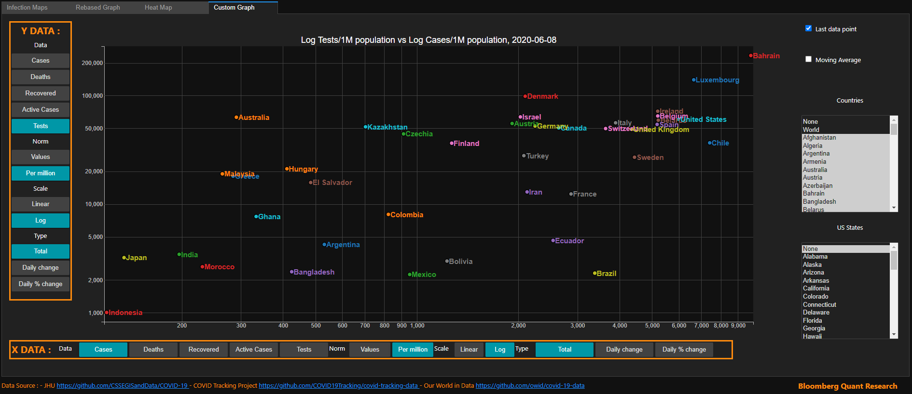

# Bloomberg Quant Research: Covid-19 Dashboard
Jupyter notebooks for Covid-19 data analysis & visualization

## Data Source

Data repository for Novel Coronavirus (COVID-19) Cases is provided by Johns Hopkins University Center for Systems Science and Engineering (JHU CSSE), which curates the datasets from various sources including WHO, CDC and others.

https://github.com/CSSEGISandData/COVID-19

## Dashboard

The Dashboard allows the users to select a country from an interactive world map and view various statistics. The first outer tab (Infection Maps) is divided into two panels. The left one presents the world and US states maps. The right panel presents a graph of Cases, Deaths, Recovered and Active Cases of the selected country/state and two tables of top 20 countries and states in the chosen category (top left toggle buttons).

There are four groups of toggle buttons in the top left panel:
* Data : Choose which data to use to color the map (Cases, Deaths, Recovered or Active Cases)
* Normalization : Use raw values or divide by population
* Scale : Log or Linear
* Type : Total (or cumulative numbers), Diff (or daily differences), % change.
Changing your selection will update map's colors, right graph and the tables.

Map interactions :
* Hover on a country or state to view its statistics.
* Click on a country or state to plot its data in the right figure.

Date selector and animation:
* Select the date of the data to represent.
* Play button to animate maps and tables.

The second outer tab presents an interactive rebased graph.
Rebased graph example : Log Cases/1MPop in France, Spain and New York since number of deaths = 1000
You can select :
* Output Data :
  * Data to plot (Cases, Deaths, Active or Recovered). Cases in our example.
  * Normalization to apply (by population or none). Per 1M Pop in our example
  * Type of time series (Total (cumulative number), Diff (daily differences) or % change). Total in our example.
  * Scale of the rebased graph (Linear or Log). Log in our example.
  * Countries or states. France Spain and New York in our example.
* Threshold Data :
  * Value of the threshold (if equal 0 it will plot data vs calendar days). 1000 in our example.
  * Data to apply threshold on (Cases, Deaths or Recovered). Deaths in our example.
  * Normalization to apply (by population or raw values). Values in our example.

The third tab shows an interactive Heatmap.
Like for the previous tab, you can select the countries/states and the data you want to plot.

The last tab allows you to create your own graph. You can select the data you want to represent on X and Y axes (by clicking on the toggle buttons) and you can select any country or US states. Also you have the possibility to represent the whole time series (Line plot) that you can animate or only the last data point (Scatter plot).

## License

This software is licensed under the Apache 2.0 license. See the [LICENSE](LICENSE) file
for details.
